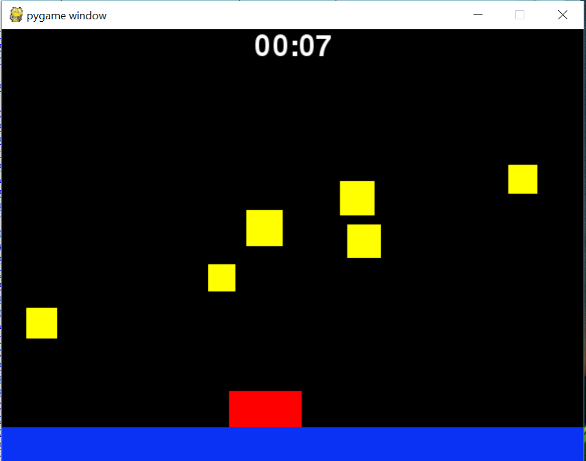

# PythonGame

Python game using pygame.  
Use arrow keys to move red box or character from left to right to dodge the falling bricks.  
Time is use to keep score of player.  

# What I Learned

* Learned using python and how to use pygame to create a game.
* Was able to add images instead of just using rectangle for player.

